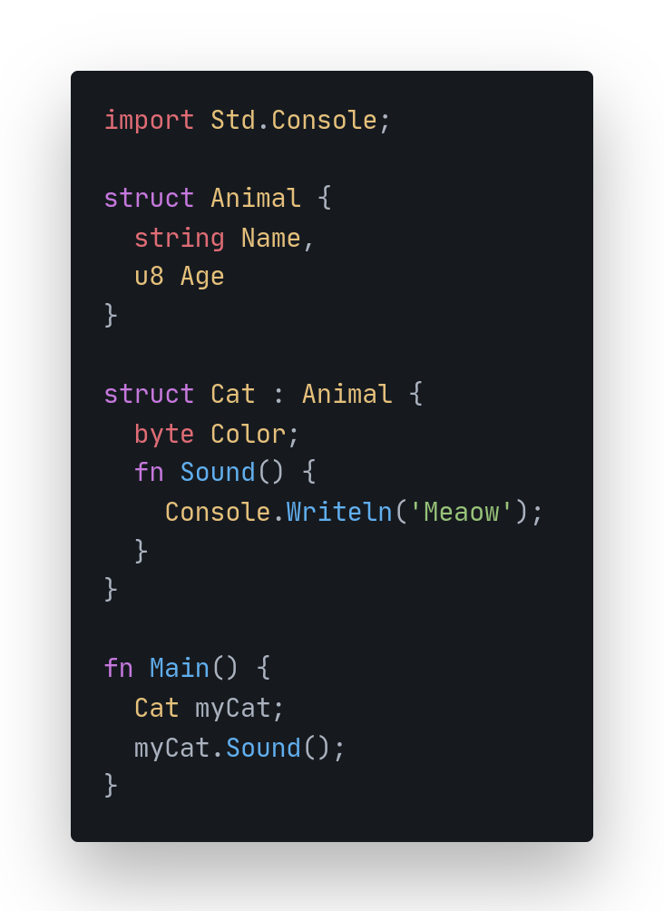

  

# Loop
Loop is a multi-paradigm programming language.

  

## What will make loop special?
- Better loops 
- Very fast performance
- Guaranteed memory safety
- Secure and robust
- Better error handling
- Rich library
- Small Executables

## How do I build and run this?

See the [Loop build instructions](docs/BuildInstructions.md).

## How do I contribute?
See the Loop [contribution guidelines](CONTRIBUTING.md).

## Before opening an issue
Please see the [issue policy](CONTRIBUTING.md#issue-policy).

## How should the grammar of Loop look like?
Take a look at the [Grammar for Loop](docs/GRAMMAR.md) `[work in progress]`

## Discord

## License

Loop is licensed under a [MIT license](LICENSE).
